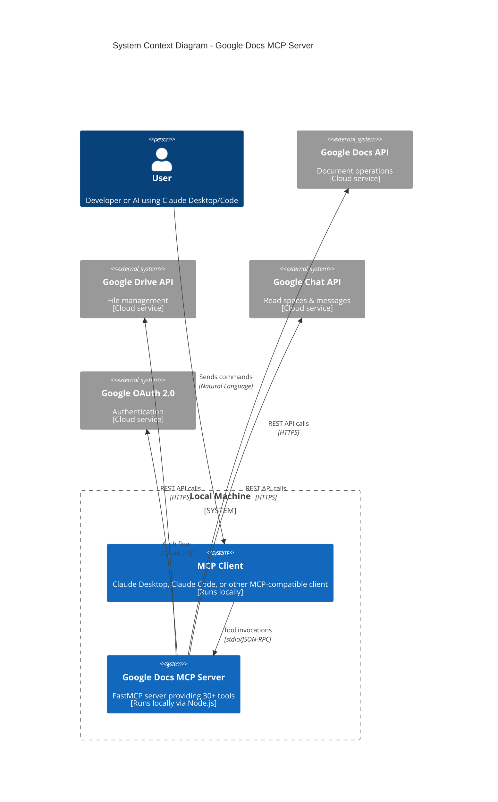

# Google Docs, Drive & Chat MCP Server


Connect Claude Desktop, Claude Code, or other MCP clients to your Google Docs, Google Drive, and Google Chat!

> 🔥 **Check out [15 powerful tasks](SAMPLE_TASKS.md) you can accomplish with this server!**
> 📁 **NEW:** Complete Google Drive file management capabilities!
> 💬 **NEW:** Google Chat integration - read and analyze your team conversations!

A comprehensive MCP server providing 30+ tools for reading, writing, formatting Google Documents, managing Drive files, handling comments, and reading Google Chat messages—all through natural language commands.

## Key Features

**Documents:** Read, write, format text/paragraphs, insert tables/images, manage structure
**Drive:** List/search/create documents, manage folders, move/copy/rename/delete files
**Comments:** List, add, reply, resolve, and delete document comments
**Chat:** Read spaces and messages from Google Chat (read-only)
**Authentication:** Secure OAuth 2.0 with Google APIs

**Full feature list:** [SAMPLE_TASKS.md](SAMPLE_TASKS.md) | **Architecture:** [CLAUDE.md](CLAUDE.md)

---

## Architecture



**Key Components:**
- **Local Machine**: Both MCP client and server run locally on your computer
  - **MCP Client**: Claude Desktop or Code (local application)
  - **MCP Server**: TypeScript/Node.js server (runs via stdio transport)
- **Cloud Services**: Google APIs accessed over HTTPS
  - **Google Docs API**: Document content operations
  - **Google Drive API**: File and folder management
  - **Google Chat API**: Read-only access to spaces and messages
- **Security**: OAuth 2.0 authentication, query injection/SSRF/path traversal protection

---

## Prerequisites

- **Node.js 18+** and npm ([download](https://nodejs.org/))
- **Git** ([download](https://git-scm.com/downloads))
- **Google Account** with access to your documents
- **Claude Desktop or Claude Code** (optional, for MCP integration)

---

## Quick Setup

### 1. Google Cloud Credentials

Create OAuth credentials to access Google APIs:

1. Go to [Google Cloud Console](https://console.cloud.google.com/)
2. Create/select a project
3. Enable **Google Docs API**, **Google Drive API**, and **Google Chat API**
4. Configure OAuth Consent Screen:
   - User Type: **External**
   - Add scopes:
     - `https://www.googleapis.com/auth/documents` (Docs access)
     - `https://www.googleapis.com/auth/drive` (Drive access)
     - `https://www.googleapis.com/auth/chat.spaces.readonly` (Chat spaces - optional)
     - `https://www.googleapis.com/auth/chat.messages.readonly` (Chat messages - optional)
   - Add yourself as Test User
5. Create Credentials → OAuth client ID → **Desktop app**
6. Download JSON → Rename to `credentials.json`

⚠️ **Keep `credentials.json` secure—never commit to version control!**

### 2. Install & Build

```bash
# Clone repository
git clone https://github.com/StefanSevelda/google-docs-mcp.git mcp-googledocs-server
cd mcp-googledocs-server

# Place credentials.json in this folder

# Install dependencies
npm install

# Build TypeScript
npm run build
```

### 3. First-Time Authorization

Run once to authenticate with Google:

```bash
node ./dist/server.js
```

1. Copy the authorization URL from terminal
2. Open in browser, sign in with your Google account
3. After allowing access, browser shows "can't be reached" (this is normal!)
4. Copy the code from URL bar (between `code=` and `&scope`)
5. Paste code into terminal

✅ You should see `token.json` created—keep this file secure!

---

## Integration with Claude

### Option 1: Claude Desktop

Edit your Claude Desktop config file:

**Config Location:**
- macOS: `~/Library/Application Support/Claude/mcp_config.json`
- Windows: `%APPDATA%\Claude\mcp_config.json`
- Linux: `~/.config/Claude/mcp_config.json`

**Add this configuration:**
```json
{
  "mcpServers": {
    "google-docs-mcp": {
      "command": "node",
      "args": ["/ABSOLUTE/PATH/TO/mcp-googledocs-server/dist/server.js"],
      "env": {}
    }
  }
}
```

Replace `/ABSOLUTE/PATH/TO/` with your actual path (use `pwd` command to find it).

Restart Claude Desktop after saving.

### Option 2: Claude Code

Claude Code can connect to MCP servers through configuration:

1. **Open Claude Code settings** (use Command Palette: "Claude Code: Open Settings")

2. **Add MCP server configuration:**
   - Navigate to MCP Servers section
   - Click "Add Server"
   - Or edit `~/.config/claude-code/config.json` directly:

```json
{
  "mcpServers": {
    "google-docs-mcp": {
      "command": "node",
      "args": ["/ABSOLUTE/PATH/TO/mcp-googledocs-server/dist/server.js"],
      "env": {}
    }
  }
}
```

3. **Restart Claude Code** or reload the window

4. **Verify connection:**
   - Type `/mcp` in Claude Code to see available servers
   - You should see "google-docs-mcp" listed with all available tools

**Using in Claude Code:**
```
"Use the google-docs-mcp server to read document ID abc123"
"List my recent Google Docs"
"Create a new document titled 'Meeting Notes'"
```

Claude Code will automatically launch the MCP server when needed.

---

## Usage Examples

**Get document ID:** Find the long string between `/d/` and `/edit` in your Google Doc URL.

**Basic operations:**
```
"Read document abc123"
"List my recent Google Docs"
"Create a new document titled 'Meeting Notes'"
"Append 'Hello World' to document abc123"
```

**Formatting:**
```
"Make the text 'Important' bold and red in document abc123"
"Center-align the paragraph containing 'Title' in document abc123"
"Insert a 3x4 table at index 500 in document abc123"
```

**Images:**
```
"Insert image from https://example.com/logo.png at index 100"
"Upload /path/to/chart.png and insert at index 200"
```

**Comments:**
```
"List all comments in document abc123"
"Add comment 'Needs review' to text at indices 50-100"
```

**Google Chat:**
```
"List my Google Chat spaces"
"Show me the last 50 messages from the Core Systems AI space"
"Read the conversation history from space spaces/AAQAtBJLgmM"
```

See [SAMPLE_TASKS.md](SAMPLE_TASKS.md) for more detailed examples.

---

## Google Chat Integration

This server provides read-only access to your Google Chat spaces and messages, allowing you to search, summarize, and analyze your team conversations.

### Prerequisites for Google Chat

The Google Chat scopes are already included in the `auth.ts` file:
- `https://www.googleapis.com/auth/chat.spaces.readonly` - Read access to spaces
- `https://www.googleapis.com/auth/chat.messages.readonly` - Read access to messages

**Important:** If you've already authorized the server, you'll need to re-authorize to grant these additional permissions:

1. **Delete the existing token:**
   ```bash
   rm token.json
   ```

2. **Re-run the authorization process:**
   ```bash
   node ./dist/server.js
   ```

3. **Grant permissions:** When the authorization screen appears, you'll now see requests for Chat permissions in addition to Docs and Drive. Click "Allow" to grant all permissions.

### Available Google Chat Tools

#### 1. List Chat Spaces (`listChatSpaces`)

Lists all Google Chat spaces (rooms and direct messages) that you're a member of.

**Parameters:**
- `pageSize` (optional): Maximum number of spaces to return (1-100, default: 50)
- `filter` (optional): Filter string (e.g., `"spaceType = SPACE"` for rooms only, `"spaceType = DIRECT_MESSAGE"` for DMs only)
- `pageToken` (optional): Token for pagination to get the next page

**Example prompts:**
- "List all my Google Chat spaces"
- "Show me the Google Chat rooms I'm in"
- "What DMs do I have in Google Chat?"

**Returns:** List of spaces with names, resource names, types, and creation dates.

#### 2. Get Space Details (`getChatSpace`)

Gets detailed information about a specific Google Chat space.

**Parameters:**
- `spaceName` (required): The resource name of the space (e.g., "spaces/SPACE_ID")

**Example prompts:**
- "Get details about the space 'spaces/AAAAtErciPM'"
- "Show me info about the AI @ N26 chat space"

**Returns:** Space metadata including display name, type, creation time, and member count.

#### 3. List Messages (`listChatMessages`)

Retrieves messages from a specific Google Chat space.

**Parameters:**
- `spaceName` (required): The resource name of the space
- `pageSize` (optional): Maximum number of messages to return (1-100, default: 25)
- `orderBy` (optional): Sort order - `"createTime desc"` (newest first, default) or `"createTime asc"` (oldest first)
- `filter` (optional): Filter for specific messages
- `pageToken` (optional): Token for pagination

**Example prompts:**
- "Show me the last 50 messages from the Core Systems AI space"
- "List recent messages from spaces/AAQAtBJLgmM"
- "Get the conversation history from the AI @ N26 chat"

**Returns:** List of messages with sender info, timestamps, text content, and thread information.

#### 4. Get Message Details (`getChatMessage`)

Gets the full details of a specific message, including complete text content.

**Parameters:**
- `messageName` (required): The resource name of the message (e.g., "spaces/SPACE_ID/messages/MESSAGE_ID")

**Example prompts:**
- "Get the full content of message spaces/AAQAtBJLgmM/messages/ZvjYVVS9av8.zGJVuu-zHPE"
- "Show me details of that message"

**Returns:** Complete message details including full text, sender, timestamp, and attachments.

### Google Chat Usage Examples

Here are practical examples of how to use Google Chat integration with Claude:

1. **Summarize recent discussions:**
   ```
   "List messages from the last 2 days in the Core Systems AI space and create a summary"
   ```

2. **Search for specific topics:**
   ```
   "Find all messages mentioning 'MCP' in the AI @ N26 chat space"
   ```

3. **Track action items:**
   ```
   "Review the last 100 messages in spaces/AAQAtBJLgmM and extract any TODOs or action items"
   ```

4. **Create meeting notes:**
   ```
   "Read the messages from the product-feedback space today and create structured meeting notes"
   ```

5. **Find important announcements:**
   ```
   "List messages from the tech space and identify any important announcements or updates"
   ```

### Finding Space IDs

To find the resource name (ID) of a space:

1. Use the `listChatSpaces` tool to see all your spaces
2. The "Resource Name" field contains the space ID (e.g., `spaces/AAQAtBJLgmM`)
3. Use this ID in subsequent commands to list or search messages

Alternatively, you can describe the space by name:
```
"Find the space called 'Core Systems AI' and list its recent messages"
```

### Limitations

**Read-Only Access:** This integration currently provides read-only access to Google Chat. You can:
- ✅ List spaces you're a member of
- ✅ Read messages and threads
- ✅ Get space and message metadata
- ❌ Send messages (not supported)
- ❌ Create spaces (not supported)
- ❌ Modify space settings (not supported)

**API Restrictions:** Google Chat API has rate limits. For heavy usage, consider:
- Using pagination to retrieve messages in batches
- Caching frequently accessed space IDs
- Limiting the number of messages retrieved per request

### Privacy & Security

**Important considerations:**
- This server has read access to ALL your Google Chat messages
- Messages are only processed locally and sent to Claude when you explicitly request them
- Be mindful when sharing Chat summaries or message content
- The `token.json` file contains access to your Chat messages - protect it carefully
- Consider the sensitivity of your Chat conversations before using this integration

---

## Troubleshooting

**MCP connection issues:**
- Verify absolute path in config file is correct
- Ensure `npm run build` completed and `dist/` folder exists
- Test manually: `node /path/to/dist/server.js`
- Check Claude logs for detailed errors

**Authorization errors:**
- Confirm Google Docs, Drive, and Chat APIs are enabled
- Verify your email is added as Test User
- Check `credentials.json` is in project root
- Delete `token.json` and re-authorize if needed

**Security Notes:**
- `credentials.json` and `token.json` are git-ignored automatically
- Consider using system keychain for production deployments
- See [CLAUDE.md](CLAUDE.md) for security audit details

---

## Documentation

- **[SAMPLE_TASKS.md](SAMPLE_TASKS.md)** - 15 example tasks you can accomplish
- **[CLAUDE.md](CLAUDE.md)** - Detailed architecture and security information
- **[vscode.md](vscode.md)** - VS Code MCP extension setup

## License

MIT License - See LICENSE file for details.