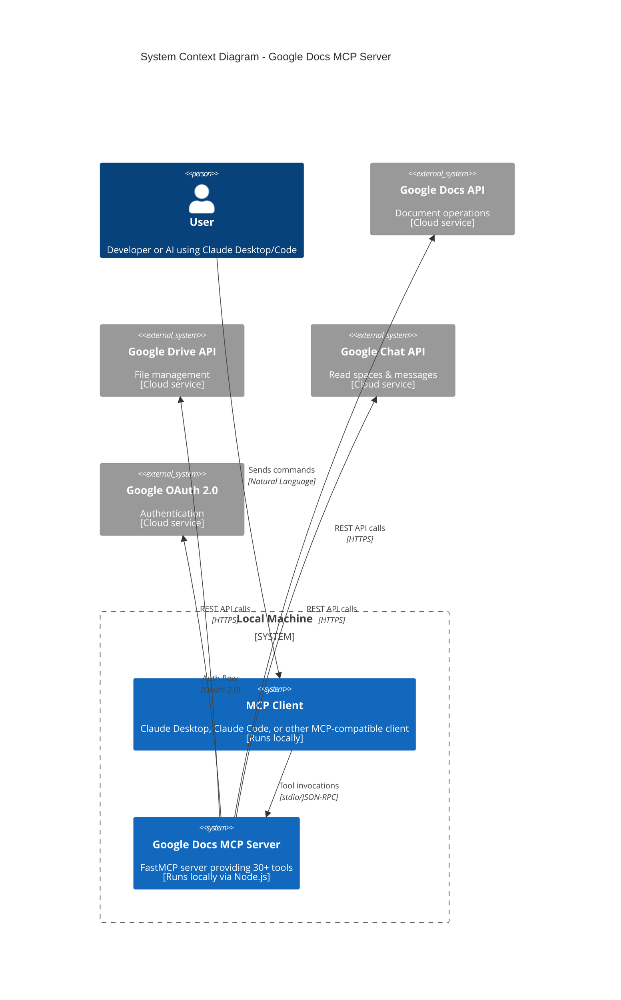

# Google Docs, Drive, Chat, Calendar & Gmail MCP Server


Connect Claude Desktop, Claude Code, or other MCP clients to your Google Docs, Google Drive, Google Chat, Google Calendar, and Gmail!

> 🔥 **Check out [15 powerful tasks](SAMPLE_TASKS.md) you can accomplish with this server!**
> 📁 **NEW:** Complete Google Drive file management capabilities!
> 💬 **NEW:** Google Chat integration - read and analyze your team conversations!
> 📅 **NEW:** Google Calendar integration - manage your schedule and events!
> 📧 **NEW:** Gmail integration - manage your emails and labels programmatically!

A comprehensive MCP server providing 50+ tools for reading, writing, formatting Google Documents, managing Drive files, handling comments, reading Google Chat messages, managing your Google Calendar, and organizing your Gmail inbox—all through natural language commands.

## Key Features

**Documents:** Read, write, format text/paragraphs, insert tables/images, manage structure
**Drive:** List/search/create documents, manage folders, move/copy/rename/delete files
**Comments:** List, add, reply, resolve, and delete document comments
**Chat:** Read spaces and messages from Google Chat (read-only)
**Calendar:** List calendars, manage events, view schedules
**Gmail:** List, search, read emails, manage labels, archive, mark as read/unread
**Authentication:** Secure OAuth 2.0 with Google APIs

**Full feature list:** [SAMPLE_TASKS.md](SAMPLE_TASKS.md) | **Architecture:** [CLAUDE.md](CLAUDE.md)

---

## Architecture



**Key Components:**
- **Local Machine**: Both MCP client and server run locally on your computer
  - **MCP Client**: Claude Desktop or Code (local application)
  - **MCP Server**: TypeScript/Node.js server (runs via stdio transport)
- **Cloud Services**: Google APIs accessed over HTTPS
  - **Google Docs API**: Document content operations
  - **Google Drive API**: File and folder management
  - **Google Chat API**: Read-only access to spaces and messages
- **Security**: OAuth 2.0 authentication, query injection/SSRF/path traversal protection

---

## Prerequisites

- **Node.js 18+** and npm ([download](https://nodejs.org/))
- **Git** ([download](https://git-scm.com/downloads))
- **Google Account** with access to your documents
- **Claude Desktop or Claude Code** (optional, for MCP integration)

---

## Quick Setup

### 1. Google Cloud Credentials

Create OAuth credentials to access Google APIs:

1. Go to [Google Cloud Console](https://console.cloud.google.com/)
2. Create/select a project
3. Enable **Google Docs API**, **Google Drive API**, **Google Chat API**, **Google Calendar API**, and **Gmail API**
4. Configure OAuth Consent Screen:
   - User Type: **External**
   - Add scopes:
     - `https://www.googleapis.com/auth/documents` (Docs access)
     - `https://www.googleapis.com/auth/drive` (Drive access)
     - `https://www.googleapis.com/auth/chat.spaces.readonly` (Chat spaces - optional)
     - `https://www.googleapis.com/auth/chat.messages.readonly` (Chat messages - optional)
     - `https://www.googleapis.com/auth/calendar` (Calendar access - optional)
     - `https://www.googleapis.com/auth/gmail.modify` (Gmail access - optional)
   - Add yourself as Test User
5. Create Credentials → OAuth client ID → **Desktop app**
6. Download JSON → Rename to `credentials.json`

⚠️ **Keep `credentials.json` secure—never commit to version control!**

### 2. Install & Build

```bash
# Clone repository
git clone https://github.com/StefanSevelda/google-docs-mcp.git mcp-googledocs-server
cd mcp-googledocs-server

# Place credentials.json in this folder

# Install dependencies
npm install

# Build TypeScript
npm run build
```

### 3. First-Time Authorization

Run once to authenticate with Google:

```bash
node ./dist/server.js
```

1. Copy the authorization URL from terminal
2. Open in browser, sign in with your Google account
3. After allowing access, browser shows "can't be reached" (this is normal!)
4. Copy the code from URL bar (between `code=` and `&scope`)
5. Paste code into terminal

✅ You should see `token.json` created—keep this file secure!

---

## Integration with Claude

### Option 1: Claude Desktop

Edit your Claude Desktop config file:

**Config Location:**
- macOS: `~/Library/Application Support/Claude/mcp_config.json`
- Windows: `%APPDATA%\Claude\mcp_config.json`
- Linux: `~/.config/Claude/mcp_config.json`

**Add this configuration:**
```json
{
  "mcpServers": {
    "google-docs-mcp": {
      "command": "node",
      "args": ["/ABSOLUTE/PATH/TO/mcp-googledocs-server/dist/server.js"],
      "env": {}
    }
  }
}
```

Replace `/ABSOLUTE/PATH/TO/` with your actual path (use `pwd` command to find it).

Restart Claude Desktop after saving.

### Option 2: Claude Code

Claude Code can connect to MCP servers through configuration:

1. **Open Claude Code settings** (use Command Palette: "Claude Code: Open Settings")

2. **Add MCP server configuration:**
   - Navigate to MCP Servers section
   - Click "Add Server"
   - Or edit `~/.config/claude-code/config.json` directly:

```json
{
  "mcpServers": {
    "google-docs-mcp": {
      "command": "node",
      "args": ["/ABSOLUTE/PATH/TO/mcp-googledocs-server/dist/server.js"],
      "env": {}
    }
  }
}
```

3. **Restart Claude Code** or reload the window

4. **Verify connection:**
   - Type `/mcp` in Claude Code to see available servers
   - You should see "google-docs-mcp" listed with all available tools

**Using in Claude Code:**
```
"Use the google-docs-mcp server to read document ID abc123"
"List my recent Google Docs"
"Create a new document titled 'Meeting Notes'"
```

Claude Code will automatically launch the MCP server when needed.

---

## Usage Examples

**Get document ID:** Find the long string between `/d/` and `/edit` in your Google Doc URL.

**Basic operations:**
```
"Read document abc123"
"List my recent Google Docs"
"Create a new document titled 'Meeting Notes'"
"Append 'Hello World' to document abc123"
```

**Formatting:**
```
"Make the text 'Important' bold and red in document abc123"
"Center-align the paragraph containing 'Title' in document abc123"
"Insert a 3x4 table at index 500 in document abc123"
```

**Images:**
```
"Insert image from https://example.com/logo.png at index 100"
"Upload /path/to/chart.png and insert at index 200"
```

**Comments:**
```
"List all comments in document abc123"
"Add comment 'Needs review' to text at indices 50-100"
```

**Google Chat:**
```
"List my Google Chat spaces"
"Show me the last 50 messages from the Core Systems AI space"
"Read the conversation history from space spaces/AAQAtBJLgmM"
```

**Google Calendar:**
```
"List my calendars"
"Show me events for this week"
"Create a meeting titled 'Team Sync' tomorrow at 2pm"
"What's on my calendar for next Monday?"
```

**Gmail:**
```
"List my unread emails"
"Search for emails from john@example.com containing 'report'"
"Archive all emails with label 'newsletter'"
"Mark all emails from last week as read"
```

See [SAMPLE_TASKS.md](SAMPLE_TASKS.md) for more detailed examples.

---

## Google Chat Integration

This server provides read-only access to your Google Chat spaces and messages, allowing you to search, summarize, and analyze your team conversations.

### Prerequisites for Google Chat

The Google Chat scopes are already included in the `auth.ts` file:
- `https://www.googleapis.com/auth/chat.spaces.readonly` - Read access to spaces
- `https://www.googleapis.com/auth/chat.messages.readonly` - Read access to messages

**Important:** If you've already authorized the server, you'll need to re-authorize to grant these additional permissions:

1. **Delete the existing token:**
   ```bash
   rm token.json
   ```

2. **Re-run the authorization process:**
   ```bash
   node ./dist/server.js
   ```

3. **Grant permissions:** When the authorization screen appears, you'll now see requests for Chat permissions in addition to Docs and Drive. Click "Allow" to grant all permissions.

### Available Google Chat Tools

#### 1. List Chat Spaces (`listChatSpaces`)

Lists all Google Chat spaces (rooms and direct messages) that you're a member of.

**Parameters:**
- `pageSize` (optional): Maximum number of spaces to return (1-100, default: 50)
- `filter` (optional): Filter string (e.g., `"spaceType = SPACE"` for rooms only, `"spaceType = DIRECT_MESSAGE"` for DMs only)
- `pageToken` (optional): Token for pagination to get the next page

**Example prompts:**
- "List all my Google Chat spaces"
- "Show me the Google Chat rooms I'm in"
- "What DMs do I have in Google Chat?"

**Returns:** List of spaces with names, resource names, types, and creation dates.

#### 2. Get Space Details (`getChatSpace`)

Gets detailed information about a specific Google Chat space.

**Parameters:**
- `spaceName` (required): The resource name of the space (e.g., "spaces/SPACE_ID")

**Example prompts:**
- "Get details about the space 'spaces/AAAAtErciPM'"
- "Show me info about the AI @ N26 chat space"

**Returns:** Space metadata including display name, type, creation time, and member count.

#### 3. List Messages (`listChatMessages`)

Retrieves messages from a specific Google Chat space.

**Parameters:**
- `spaceName` (required): The resource name of the space
- `pageSize` (optional): Maximum number of messages to return (1-100, default: 25)
- `orderBy` (optional): Sort order - `"createTime desc"` (newest first, default) or `"createTime asc"` (oldest first)
- `filter` (optional): Filter for specific messages
- `pageToken` (optional): Token for pagination

**Example prompts:**
- "Show me the last 50 messages from the Core Systems AI space"
- "List recent messages from spaces/AAQAtBJLgmM"
- "Get the conversation history from the AI @ N26 chat"

**Returns:** List of messages with sender info, timestamps, text content, and thread information.

#### 4. Get Message Details (`getChatMessage`)

Gets the full details of a specific message, including complete text content.

**Parameters:**
- `messageName` (required): The resource name of the message (e.g., "spaces/SPACE_ID/messages/MESSAGE_ID")

**Example prompts:**
- "Get the full content of message spaces/AAQAtBJLgmM/messages/ZvjYVVS9av8.zGJVuu-zHPE"
- "Show me details of that message"

**Returns:** Complete message details including full text, sender, timestamp, and attachments.

### Google Chat Usage Examples

Here are practical examples of how to use Google Chat integration with Claude:

1. **Summarize recent discussions:**
   ```
   "List messages from the last 2 days in the Core Systems AI space and create a summary"
   ```

2. **Search for specific topics:**
   ```
   "Find all messages mentioning 'MCP' in the AI @ N26 chat space"
   ```

3. **Track action items:**
   ```
   "Review the last 100 messages in spaces/AAQAtBJLgmM and extract any TODOs or action items"
   ```

4. **Create meeting notes:**
   ```
   "Read the messages from the product-feedback space today and create structured meeting notes"
   ```

5. **Find important announcements:**
   ```
   "List messages from the tech space and identify any important announcements or updates"
   ```

### Finding Space IDs

To find the resource name (ID) of a space:

1. Use the `listChatSpaces` tool to see all your spaces
2. The "Resource Name" field contains the space ID (e.g., `spaces/AAQAtBJLgmM`)
3. Use this ID in subsequent commands to list or search messages

Alternatively, you can describe the space by name:
```
"Find the space called 'Core Systems AI' and list its recent messages"
```

### Limitations

**Read-Only Access:** This integration currently provides read-only access to Google Chat. You can:
- ✅ List spaces you're a member of
- ✅ Read messages and threads
- ✅ Get space and message metadata
- ❌ Send messages (not supported)
- ❌ Create spaces (not supported)
- ❌ Modify space settings (not supported)

**API Restrictions:** Google Chat API has rate limits. For heavy usage, consider:
- Using pagination to retrieve messages in batches
- Caching frequently accessed space IDs
- Limiting the number of messages retrieved per request

### Privacy & Security

**Important considerations:**
- This server has read access to ALL your Google Chat messages
- Messages are only processed locally and sent to Claude when you explicitly request them
- Be mindful when sharing Chat summaries or message content
- The `token.json` file contains access to your Chat messages - protect it carefully
- Consider the sensitivity of your Chat conversations before using this integration

---

## Google Calendar Integration

Manage your Google Calendar events, view your schedule, and create meetings directly through natural language commands.

### Prerequisites for Google Calendar

The Google Calendar scope is already included in the `auth.ts` file:
- `https://www.googleapis.com/auth/calendar` - Full access to manage calendar events

**Important:** If you've already authorized the server, you'll need to re-authorize to grant Calendar permissions:

1. **Delete the existing token:**
   ```bash
   rm token.json
   ```

2. **Re-run the authorization process:**
   ```bash
   node ./dist/server.js
   ```

3. **Grant permissions:** When the authorization screen appears, you'll now see requests for Calendar permissions in addition to Docs, Drive, and Chat. Click "Allow" to grant all permissions.

### Available Google Calendar Tools

#### 1. List Calendars (`listCalendars`)

Lists all calendars you have access to.

**Parameters:**
- `minAccessRole` (optional): Filter by minimum access role (freeBusyReader, reader, writer, owner)
- `showHidden` (optional): Whether to show hidden calendars (default: false)
- `maxResults` (optional): Maximum number to return (1-250, default: 100)
- `pageToken` (optional): Token for pagination

**Example prompts:**
- "List my calendars"
- "Show me all my Google calendars"
- "What calendars do I have access to?"

**Returns:** List of calendars with IDs, names, access roles, and time zones.

#### 2. List Calendar Events (`listCalendarEvents`)

Lists events from a specific calendar within a time range.

**Parameters:**
- `calendarId` (optional): Calendar ID (default: "primary" for your main calendar)
- `timeMin` (optional): Start of time range in RFC3339 format (e.g., "2024-01-01T00:00:00Z")
- `timeMax` (optional): End of time range in RFC3339 format
- `maxResults` (optional): Maximum events to return (1-2500, default: 250)
- `orderBy` (optional): Sort order - "startTime" or "updated"
- `q` (optional): Free text search query
- `pageToken` (optional): Token for pagination

**Example prompts:**
- "Show me events for this week"
- "What's on my calendar today?"
- "List all meetings in January 2024"
- "Find events containing 'review' in my calendar"

**Returns:** List of events with titles, times, locations, attendees, and meeting links.

#### 3. Get Calendar Event (`getCalendarEvent`)

Gets detailed information about a specific event.

**Parameters:**
- `calendarId` (optional): Calendar ID (default: "primary")
- `eventId` (required): The event ID

**Example prompts:**
- "Show me details for event abc123"
- "Get full information about that meeting"

**Returns:** Complete event details including description, attendees, recurrence, and conference info.

#### 4. Create Calendar Event (`createCalendarEvent`)

Creates a new event in your calendar.

**Parameters:**
- `calendarId` (optional): Calendar ID (default: "primary")
- `summary` (required): Event title
- `description` (optional): Event description
- `location` (optional): Event location
- `startDateTime` (optional): Start time in RFC3339 format (for timed events)
- `endDateTime` (optional): End time in RFC3339 format (for timed events)
- `startDate` (optional): Start date in YYYY-MM-DD format (for all-day events)
- `endDate` (optional): End date in YYYY-MM-DD format (for all-day events)
- `timeZone` (optional): Time zone (e.g., "America/Los_Angeles")
- `attendees` (optional): List of attendee email addresses
- `recurrence` (optional): Recurrence rules (e.g., ["RRULE:FREQ=DAILY;COUNT=5"])
- `reminders` (optional): Custom reminder settings
- `conferenceData` (optional): Video conference settings
- `visibility` (optional): Event visibility (default, public, private, confidential)

**Example prompts:**
- "Create a meeting titled 'Team Sync' tomorrow at 2pm"
- "Schedule an all-day event 'Conference' on March 15th"
- "Add a 30-minute call with john@example.com next Monday at 10am"

**Returns:** Confirmation with event ID and calendar link.

#### 5. Update Calendar Event (`updateCalendarEvent`)

Updates an existing calendar event.

**Parameters:**
- `calendarId` (optional): Calendar ID (default: "primary")
- `eventId` (required): The event ID to update
- `summary` (optional): New event title
- `description` (optional): New description
- `location` (optional): New location
- `startDateTime` / `startDate` (optional): New start time/date
- `endDateTime` / `endDate` (optional): New end time/date
- `attendees` (optional): Updated attendee list
- `status` (optional): Event status (confirmed, tentative, cancelled)

**Example prompts:**
- "Move that meeting to 3pm"
- "Change the location of event abc123 to 'Conference Room A'"
- "Add sarah@example.com to tomorrow's team meeting"

**Returns:** Confirmation with updated event details.

#### 6. Delete Calendar Event (`deleteCalendarEvent`)

Deletes an event from your calendar.

**Parameters:**
- `calendarId` (optional): Calendar ID (default: "primary")
- `eventId` (required): The event ID to delete

**Example prompts:**
- "Delete event abc123"
- "Cancel tomorrow's 10am meeting"
- "Remove that event from my calendar"

**Returns:** Confirmation that the event was deleted.

### Google Calendar Usage Examples

Here are practical examples of how to use Calendar integration with Claude:

1. **Daily schedule review:**
   ```
   "What meetings do I have today?"
   "Show me my schedule for tomorrow"
   ```

2. **Weekly planning:**
   ```
   "List all my events for this week"
   "What's my availability next week?"
   ```

3. **Meeting management:**
   ```
   "Create a 1-hour meeting with john@example.com titled 'Project Review' next Tuesday at 2pm"
   "Add a reminder for 'Dentist Appointment' on Friday at 9am"
   ```

4. **Event scheduling:**
   ```
   "Schedule a recurring weekly meeting every Monday at 10am"
   "Block my calendar for 'Focus Time' every afternoon from 2-4pm"
   ```

5. **Calendar organization:**
   ```
   "List all meetings containing 'review' in the next month"
   "Find free slots in my calendar this week"
   ```

### Time Formats

**For timed events (specific hours):**
- Use RFC3339 format with timezone: `"2024-01-15T14:00:00-08:00"`
- Or ISO 8601 format: `"2024-01-15T14:00:00Z"`

**For all-day events:**
- Use date format: `"2024-01-15"`
- End date is exclusive (use next day for single-day events)

**Natural language:** Claude can convert natural language like "tomorrow at 2pm" or "next Monday" into proper date formats.

### Privacy & Security

**Important considerations:**
- This server has full access to your Google Calendar
- Events are only processed locally and sent to Claude when you explicitly request them
- Be mindful when sharing calendar information
- The `token.json` file contains access to your calendar - protect it carefully
- Consider the sensitivity of your meeting information before using this integration

---

## Gmail Integration

Manage your Gmail inbox, search emails, organize with labels, and perform bulk operations—all through natural language commands.

### Prerequisites for Gmail

The Gmail scope is already included in the `auth.ts` file:
- `https://www.googleapis.com/auth/gmail.modify` - Full access to manage emails (read, archive, label, delete)

**Important:** If you've already authorized the server, you'll need to re-authorize to grant Gmail permissions:

1. **Delete the existing token:**
   ```bash
   rm token.json
   ```

2. **Re-run the authorization process:**
   ```bash
   node ./dist/server.js
   ```

3. **Grant permissions:** When the authorization screen appears, you'll now see requests for Gmail permissions. Click "Allow" to grant all permissions.

### Available Gmail Tools

#### 1. List Emails (`listEmails`)

Lists emails from your inbox with optional filtering.

**Parameters:**
- `maxResults` (optional): Maximum emails to return (1-500, default: 50)
- `query` (optional): Gmail search query (e.g., "is:unread", "from:john@example.com")
- `labelIds` (optional): Filter by label IDs (e.g., ["INBOX", "UNREAD"])
- `includeSpamTrash` (optional): Include spam/trash (default: false)
- `pageToken` (optional): Token for pagination

**Example prompts:**
- "List my recent emails"
- "Show me unread emails"
- "List emails in my inbox from this week"

**Returns:** List of emails with subjects, senders, dates, snippets, and labels.

#### 2. Search Emails (`searchEmails`)

Searches emails using Gmail's powerful search syntax.

**Parameters:**
- `query` (required): Gmail search query
- `maxResults` (optional): Maximum emails to return (1-500, default: 50)
- `pageToken` (optional): Token for pagination

**Example prompts:**
- "Search for emails from john@example.com containing 'report'"
- "Find all emails with attachments from last month"
- "Search for unread emails about 'meeting'"

**Gmail Search Syntax Examples:**
- `from:user@example.com` - Emails from specific sender
- `subject:report` - Emails with "report" in subject
- `has:attachment` - Emails with attachments
- `is:unread` - Unread emails
- `after:2024/01/01` - Emails after specific date
- `label:work` - Emails with "work" label

**Returns:** List of matching emails with full metadata.

#### 3. Get Email (`getEmail`)

Gets the full content of a specific email.

**Parameters:**
- `messageId` (required): The Gmail message ID
- `format` (optional): Format - "full" (default), "metadata", "minimal", or "raw"

**Example prompts:**
- "Show me the full content of email abc123"
- "Read email with ID xyz789"

**Returns:** Complete email with body text, headers, and attachments info.

#### 4. Archive Email (`archiveEmail`)

Archives one or more emails (removes from Inbox). Supports batch operations up to 1000 emails.

**Parameters:**
- `messageIds` (required): Array of message IDs to archive

**Example prompts:**
- "Archive email abc123"
- "Archive all emails from newsletters"

**Returns:** Confirmation of archived emails.

#### 5. Mark Email (`markEmail`)

Marks emails as read/unread, starred/unstarred, or important. Supports batch operations up to 1000 emails.

**Parameters:**
- `messageIds` (required): Array of message IDs
- `markAs` (required): "read", "unread", "starred", "unstarred", "important", or "not_important"

**Example prompts:**
- "Mark email abc123 as read"
- "Star all emails from my boss"
- "Mark all unread emails as read"

**Returns:** Confirmation of marked emails.

#### 6. Modify Email Labels (`modifyEmailLabels`)

Adds or removes labels from emails. Supports batch operations up to 1000 emails.

**Parameters:**
- `messageIds` (required): Array of message IDs
- `addLabelIds` (optional): Labels to add (e.g., ["STARRED", "IMPORTANT"])
- `removeLabelIds` (optional): Labels to remove (e.g., ["UNREAD", "INBOX"])

**Example prompts:**
- "Add 'work' label to email abc123"
- "Remove 'inbox' label from all newsletters"

**Returns:** Confirmation of label changes.

#### 7. List Labels (`listLabels`)

Lists all Gmail labels (both system and custom).

**Example prompts:**
- "List my Gmail labels"
- "Show me all my email labels"

**Returns:** List of labels with IDs, names, types, and message counts.

#### 8. Create Label (`createLabel`)

Creates a new custom label.

**Parameters:**
- `name` (required): Name for the new label
- `labelListVisibility` (optional): "labelShow", "labelShowIfUnread", or "labelHide"
- `messageListVisibility` (optional): "show" or "hide"

**Example prompts:**
- "Create a label called 'Important Projects'"
- "Create a new label named 'Follow-up'"

**Returns:** Confirmation with new label ID.

#### 9. Delete Label (`deleteLabel`)

Deletes a custom label (doesn't delete emails, only the label).

**Parameters:**
- `labelId` (required): ID of the label to delete

**Example prompts:**
- "Delete the label 'Old Projects'"
- "Remove the label with ID Label_123"

**Returns:** Confirmation that label was deleted.

### Gmail Usage Examples

Here are practical examples of how to use Gmail integration with Claude:

1. **Inbox management:**
   ```
   "Show me my unread emails"
   "List all emails from this week"
   "Archive all read emails from newsletters"
   ```

2. **Email search and filtering:**
   ```
   "Find emails from john@example.com about 'budget'"
   "Search for unread emails with attachments"
   "Show me all emails labeled 'urgent'"
   ```

3. **Bulk operations:**
   ```
   "Mark all emails from last month as read"
   "Archive all emails with label 'newsletter'"
   "Star all emails from my manager"
   ```

4. **Label organization:**
   ```
   "Create labels for 'Projects', 'Follow-up', and 'Archive'"
   "Add 'work' label to all emails from @company.com"
   "List all my custom labels"
   ```

5. **Email triage:**
   ```
   "Show me unread emails from the last 3 days and summarize them"
   "Find important emails I haven't responded to"
   "List all emails that need follow-up"
   ```

### Gmail Search Query Syntax

Gmail supports powerful search operators:

- **Sender/Recipient**: `from:`, `to:`, `cc:`, `bcc:`
- **Subject**: `subject:"exact phrase"`
- **Content**: `"exact phrase"`, `word1 OR word2`
- **Date**: `after:2024/01/01`, `before:2024/12/31`, `older_than:7d`, `newer_than:2d`
- **Status**: `is:read`, `is:unread`, `is:starred`, `is:important`
- **Attachments**: `has:attachment`, `filename:pdf`
- **Labels**: `label:work`, `label:inbox`
- **Size**: `size:1000000` (bytes), `larger:10M`, `smaller:1M`

### Batch Operations

All email modification tools support batch operations:
- Up to **1000 emails** can be modified in a single operation
- More efficient than individual operations
- Useful for bulk archiving, labeling, or marking emails

### Privacy & Security

**Important considerations:**
- This server has full access to your Gmail inbox
- Emails are only processed locally and sent to Claude when you explicitly request them
- Be mindful when sharing email content or summaries
- The `token.json` file contains access to your emails - protect it carefully
- Consider the sensitivity of your email content before using this integration

---

## Troubleshooting

**MCP connection issues:**
- Verify absolute path in config file is correct
- Ensure `npm run build` completed and `dist/` folder exists
- Test manually: `node /path/to/dist/server.js`
- Check Claude logs for detailed errors

**Authorization errors:**
- Confirm Google Docs, Drive, and Chat APIs are enabled
- Verify your email is added as Test User
- Check `credentials.json` is in project root
- Delete `token.json` and re-authorize if needed

**Security Notes:**
- `credentials.json` and `token.json` are git-ignored automatically
- Consider using system keychain for production deployments
- See [CLAUDE.md](CLAUDE.md) for security audit details

---

## Documentation

- **[SAMPLE_TASKS.md](SAMPLE_TASKS.md)** - 15 example tasks you can accomplish
- **[CLAUDE.md](CLAUDE.md)** - Detailed architecture and security information
- **[vscode.md](vscode.md)** - VS Code MCP extension setup

## License

MIT License - See LICENSE file for details.